<div align="center">
  
  
  
  
  
  
</div>

<h1 align="center">Конструирование Программного Обеспечения - КР-3: Асинхронное межсервисное взаимодействие</h1>

---

## Функционал

Проект состоит из **четырех независимых сервисов**, каждый из которых упакован в собственный Docker-контейнер и выполняет четко определенную роль.
<p align="center">
  <br>
  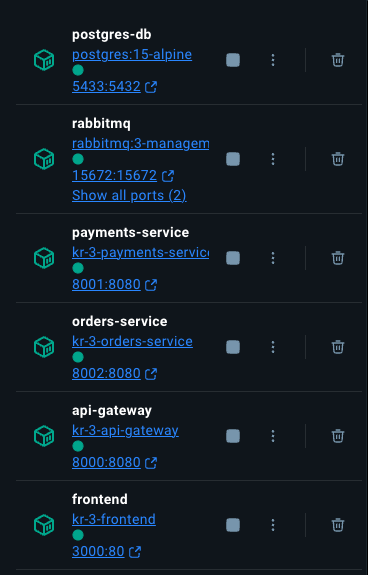  
</p>

### Frontend (React + Material-UI)
Десктопное веб-приложение, служащее единой точкой входа для пользователя.
- **Интерактивная панель управления** для мониторинга баланса и заказов.
- **Динамическое создание** уникального `User ID` для сессии.
- **Асинхронное обновление** данных без перезагрузки страницы.
- **Функционал:** пополнение счета, создание заказа, просмотр истории заказов с актуальными статусами.

### API Gateway (Ocelot)
Единая точка входа для всех запросов от фронтенда.
- **Маршрутизация** запросов к соответствующим бэкенд-сервисам.
- **Агрегация Swagger UI**, предоставляя единую страницу документации для всего API.
- **Настройка CORS** для безопасного взаимодействия с фронтендом.

### Payments Service (C# / .NET 8)
Микросервис, отвечающий за всю финансовую логику.
- **Управление счетами:** создание, пополнение, проверка баланса.
- **Обработка платежей:** асинхронно получает события о новых заказах и производит списание средств.
- **Обеспечение идемпотентности** при обработке платежей для предотвращения двойного списания.

### Orders Service (C# / .NET 8)
Микросервис для управления жизненным циклом заказов.
- **Создание заказов:** принимает запросы на создание новых заказов и инициирует процесс оплаты.
- **Управление статусами:** асинхронно получает результаты оплаты и обновляет статус заказа на `Finished` или `Cancelled`.
- **Просмотр истории** заказов для конкретного пользователя.

## 🛠️ Технологический стек

- **Бэкенд:** `C# 12`, `.NET 8`, `ASP.NET Core`
- **Фронтенд:** `React`, `Vite`, `Material-UI (MUI)`, `axios`
- **База данных:** `PostgreSQL` (с разделением по схемам для каждого сервиса)
- **Брокер сообщений:** `RabbitMQ` для асинхронной коммуникации
- **API Gateway:** `Ocelot`
- **Контейнеризация:** `Docker`, `Docker Compose`
- **Тестирование:** `xUnit`, `Moq`

---

##  Архитектура и паттерны

### Асинхронное взаимодействие

Коммуникация между `Orders Service` и `Payments Service` построена на обмене событиями через брокер сообщений **RabbitMQ**. 

1.  **Создание заказа:** `Orders Service` публикует событие `OrderCreatedEvent`.
2.  **Обработка платежа:** `Payments Service` подписывается на это событие, обрабатывает платеж и публикует ответное событие `PaymentResultEvent`.
3.  **Обновление статуса:** `Orders Service` получает результат и обновляет статус заказа.

### Паттерны надежной доставки

Для гарантии того, что ни одно сообщение не будет потеряно, и данные останутся консистентными даже в случае сбоев, применены следующие паттерны:

- **Transactional Outbox (в `Orders Service` и `Payments Service`):**
  - При выполнении бизнес-операции (например, создание заказа) сервис атомарно, в рамках **одной транзакции базы данных**, сохраняет и саму бизнес-сущность (заказ), и исходящее событие в специальную таблицу `OutboxMessages`.
  - Отдельный фоновый процесс периодически опрашивает эту таблицу и отправляет неотправленные сообщения в RabbitMQ. Это гарантирует, что сообщение будет отправлено **хотя бы раз (at-least-once)**.

- **Transactional Inbox (в `Payments Service`):**
  - При получении события `OrderCreatedEvent` сервис не выполняет бизнес-логику сразу.
  - Сначала он сохраняет ID входящего сообщения в таблицу `InboxMessages` и только потом, в той же транзакции, обрабатывает платеж.
  - Перед обработкой любого сообщения он проверяет, нет ли его ID в `Inbox`. Это защищает от повторной обработки дублирующихся сообщений.

### ⭐ Отдельный плюс: Реализация семантики Exactly-Once

В критически важной операции — списании денег со счета — обеспечена семантика **"exactly-once**. Это достигается комбинацией двух паттернов и механизма оптимистичной блокировки:

1.  **`Transactional Inbox`** на входе в `Payments Service` гарантирует, что даже если RabbitMQ доставит одно и то же сообщение о создании заказа несколько раз, оно будет обработано только один раз (семантика **at-most-once**).
2.  **`Transactional Outbox`** на выходе гарантирует, что событие с результатом платежа будет надежно доставлено (семантика **at-least-once**).
3.  **Оптимистичная блокировка** (`Timestamp`/`RowVersion` в EF Core) на сущности `Account` предотвращает "гонку состояний" при параллельных операциях списания с одного и того же счета.

---

## Как запустить проект

1.  **Все просто:**
    ```bash
    docker-compose up --build -d
    ```

2.  **В браузере:**
    - **Frontend:** `http://localhost:3000`
    - **API Gateway Swagger UI:** `http://localhost:8000/swagger`
    - **RabbitMQ Management:** `http://localhost:15672` (login: `user`, pass: `password`)

---

## Тестирование

<table align="center">
  <tr>
    <td align="center">
      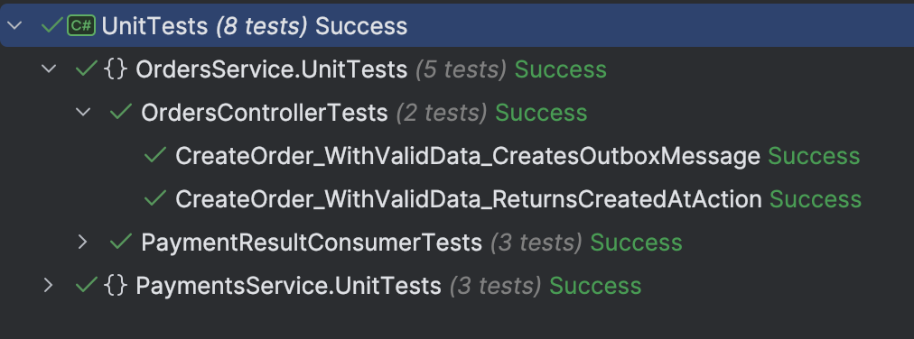<br/>
      <sub>Тестами покрыты ключевая бизнес-логика</sub>
    </td>
    <td align="center">
      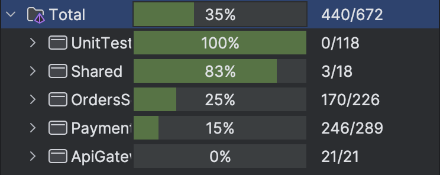<br/>
      <sub>Тестовое покрытие</sub>
    </td>
  </tr>
</table>

---

## Swagger

- **API Gateway Swagger UI:** `http://localhost:8000/swagger`
- **API Payments Swagger UI:** `http://localhost:8001/swagger`
- **API Orders Swagger UI:** `http://localhost:8002/swagger`

<p align="center">
  API Gateway Swagger - Orders API
  <br>
  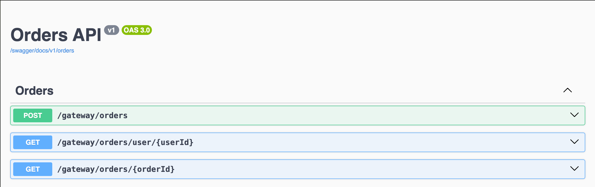  
</p>

---

<p align="center">
  API Gateway Swagger - Payments API
  <br>
  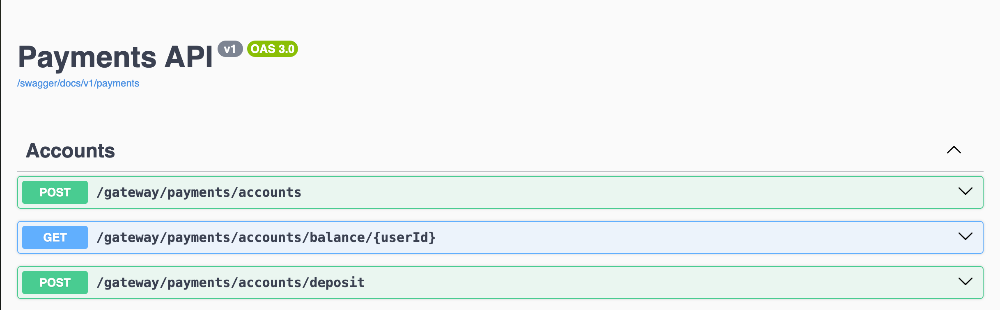  
</p>

---

<p align="center">
  Успешное создание банковского аккаунта
  <br>
  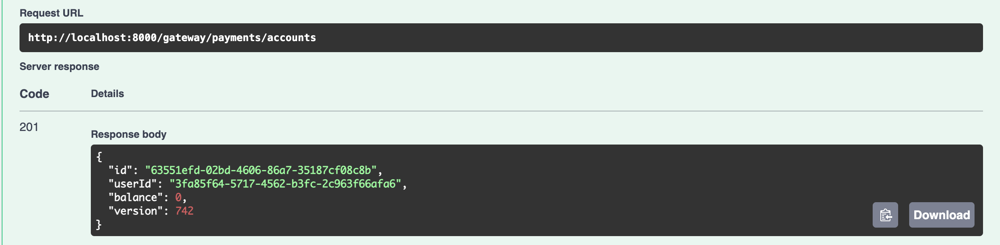  
</p>

---

<p align="center">
  Успешное пополнение банковского счета на 400 у.е.
  <br>
  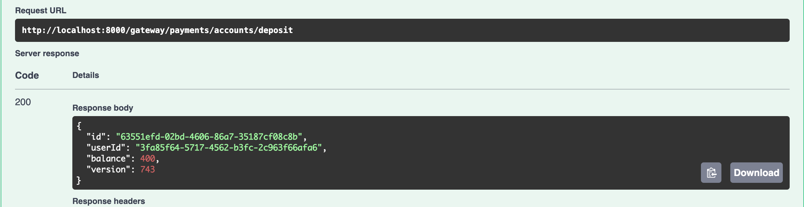  
</p>

---

<p align="center">
  Проверка баланса
  <br>
  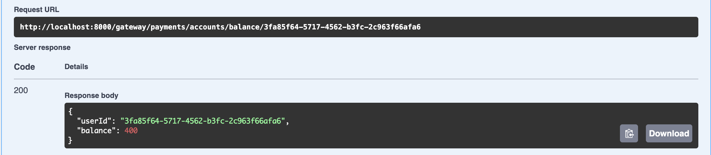  
</p>

---

<p align="center">
  Создание заказа стоимостью 500 у.е.; Статус заказа - NEW, ожидаем статус CANCELLED
  <br>
  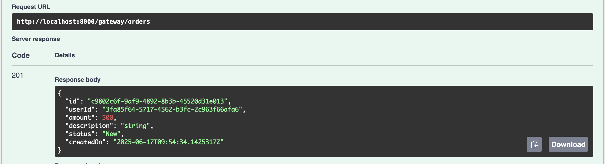  
</p>

---

<p align="center">
  Спустя время проверяем статус заказа по его id; Ожидаемый результат совпадает с фактическим - статус CANCELLED (нехватка средств)
  <br>
  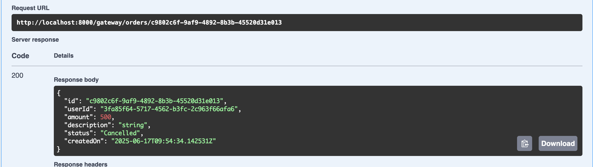  
</p>

---

<p align="center">
  Создаем новый заказ - стоимость 400 у.е.; Статус заказа - NEW, ожидаем статус FINISHED
  <br>
  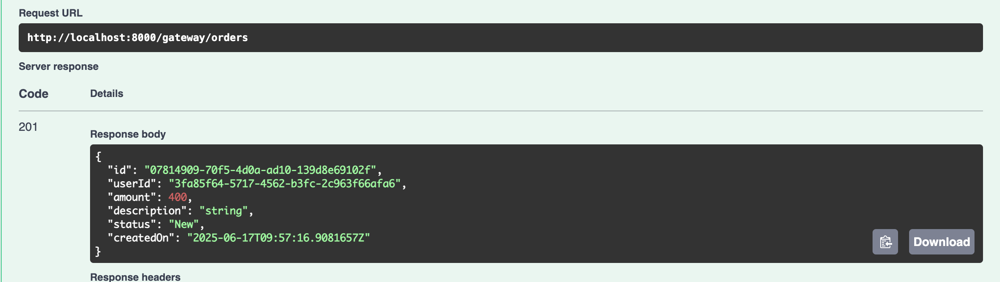  
</p>

---

<p align="center">
  Проверяем все заказы по user_id; Все верно - один FINISHED заказ и один CANCELLED
  <br>
    
</p>

---

<p align="center">
  Проверяем, что баланс пользователя изменился после создания заказов
  <br>
  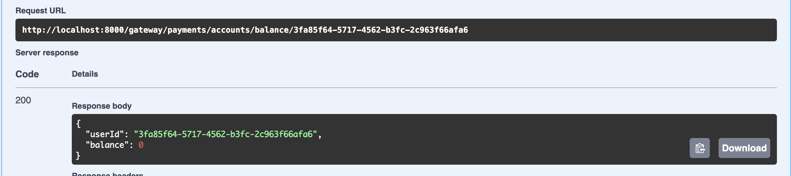  
</p>

---

## Frontend

<p align="center">
  Стартовый экран (баланс 0)
  <br>
  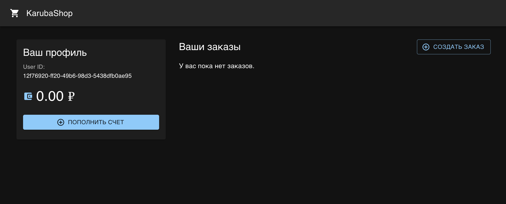  
</p>

---

<p align="center">
  Пополняем баланс 1000 у.е.
  <br>
  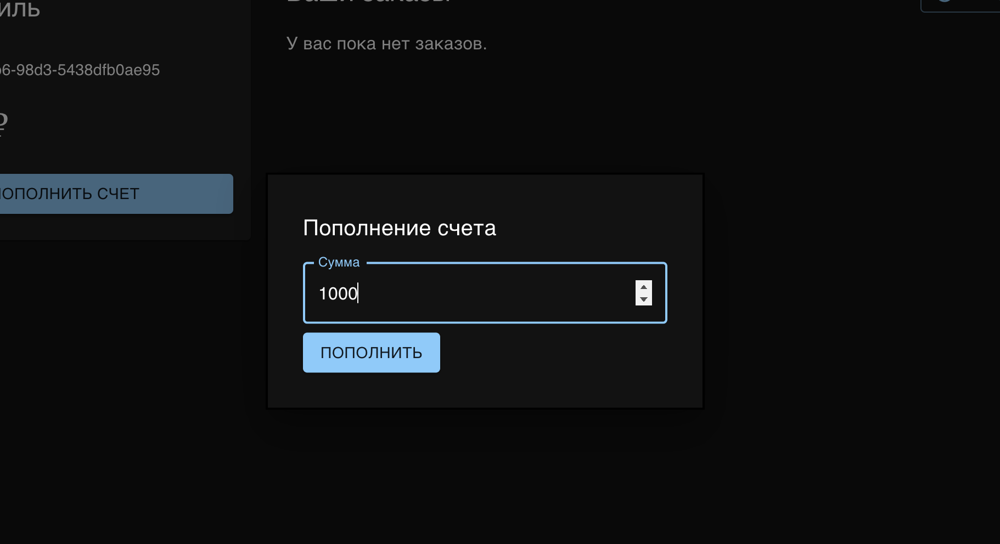  
</p>

---

<p align="center">
  Совершаем покупку на 1200 у.е. (ожидаем статус CANCELLED)
  <br>
  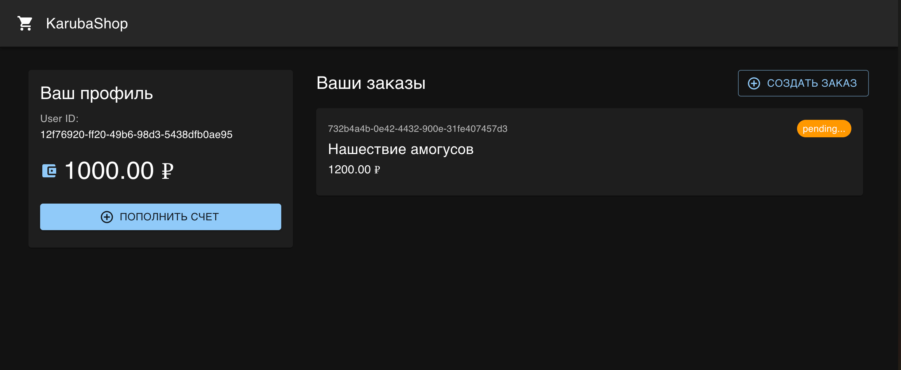  
</p>

---

<p align="center">
  Ожидаемый результат совпадает с фактическим, деньги не списались
  <br>
  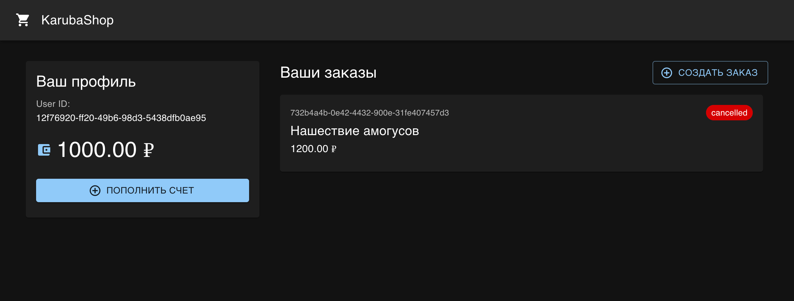  
</p>

---

<p align="center">
  Совершаем еще несколько заказов (в сумме на 1000 у.е.); Ожидаем статус FINISHED
  <br>
  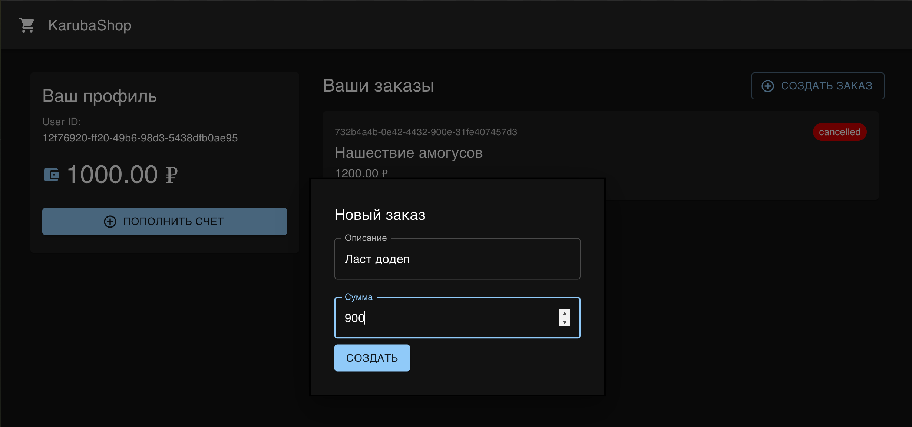  
</p>

---

<p align="center">
  Ожидаемый результат совпадает с фактическим, деньги списались, заказы выполнены
  <br>
  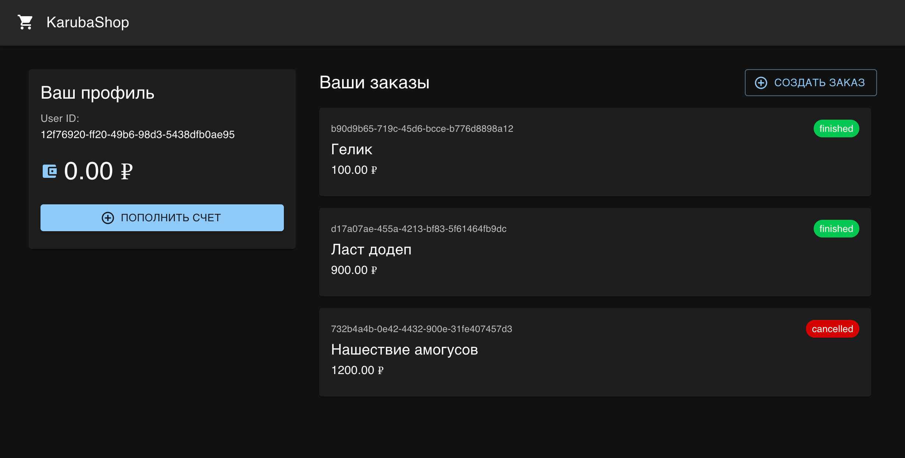  
</p>